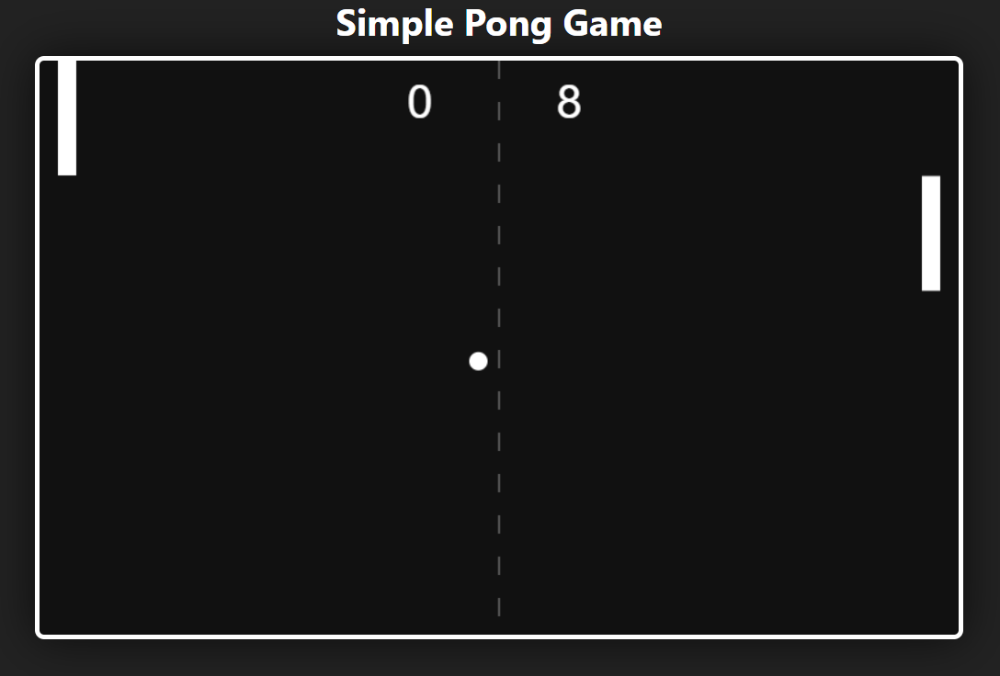

# 🏓 Ping Pong Game

A fun and simple Ping Pong (Paddle) game made using **HTML**, **CSS**, and **JavaScript**. Challenge yourself and test your reflexes in this browser-based arcade game!

## 🎮 Demo

> [Click here to play the game](#)  
> *(Add your GitHub Pages or live demo link here)*

## 📸 Screenshots



## 🚀 Features

- Player vs. AI paddle
- Real-time ball movement
- Score tracking
- Game restart on score
- Smooth animations with pure JS

## 🛠️ Built With

- HTML5
- CSS3
- JavaScript (Vanilla)

## 📂 Folder Structure
ping-pong-game/
├── index.html
├── style.css
├── script.js
└── README.md


## 🧑‍💻 How to Run

1. Clone this repository:
   ```bash
   git clone https://github.com/your-username/ping-pong-game.git

cd ping-pong-game
open index.html


💡 Future Improvements
Add difficulty levels

Sound effects

Multiplayer mode

Mobile responsiveness

🧾 License
This project is open source and available under the MIT License.

🙌 Acknowledgements
Thanks to the open-source community for inspiration and support


Feel free to ⭐ the repo if you liked the game!


